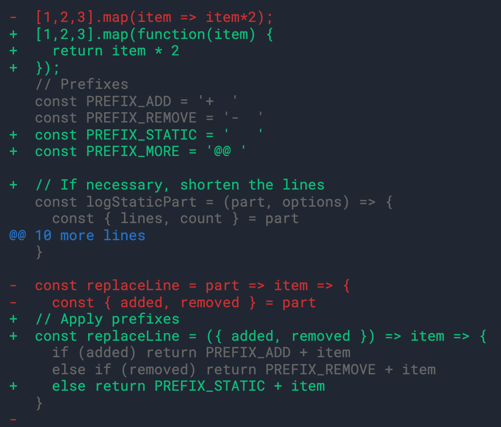

# [fake-diff](https://www.npmjs.com/package/fake-diff)

**fake-diff** is a tiny Node.js plugin that you can include in your projects. You can install it via following command:

```bash
npm install fake-diff
```

## Usage
Simply compare two strings as the first and second argument:
```js
const fakeDiff = require('fake-diff')
console.log(fakeDiff(oldString, newString))
```
Example output:
# 
Or you can pass files:
```js
const fs = require('fs')
const fakeDiff = require('fake-diff')
const oldFileContent = fs.readFileSync(__dirname  +  "/oldFile.txt",  "utf-8")
const newFileContent = fs.readFileSync(__dirname  +  "/newFile.txt",  "utf-8")
console.log(fakeDiff(oldFileContent, newFileContent))
```
Also takes the following options as an object in the third parameter:
`fakeDiff(oldFile, newFile, options)`
| Option | Type | Default Value |
|--|--|--|
| hideLines | boolean | true |
| maxAdjacentStaticLines | number | 1

## Credit

Relies on [diff (npm package)](https://www.npmjs.com/package/diff) to generate line diffs, and [chalk](https://www.npmjs.com/package/chalk) for coloring. 

**Alternatives:**
[git-diff (npm package)](https://www.npmjs.com/package/git-diff)

## License
MIT